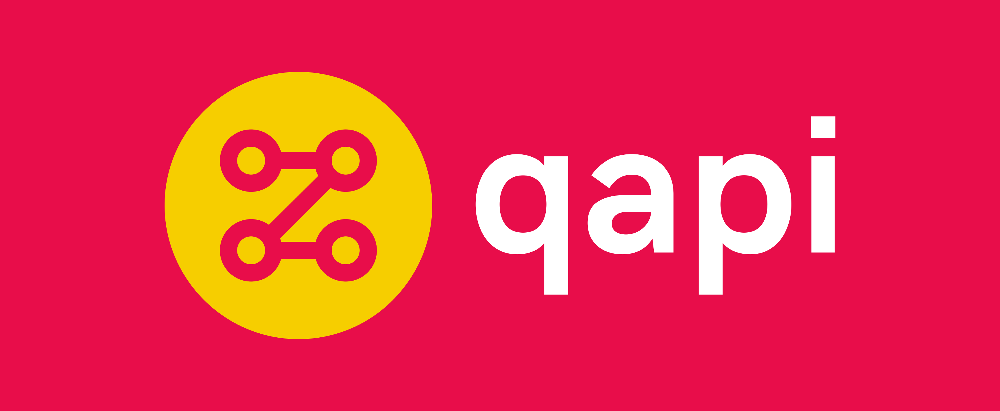

# 

# qapi
Run Quality Assurance tests against an API endpoint.

The name qapi is a portmanteau of the initialisms QA and API. To pronounce it, simply say the letters "Q-A-P-I".

## Installation

#### From source

```
$ go get -u github.com/codingconcepts/qapi
```

#### From binary

1. Download the tar file that matches your OS from the [release page](https://github.com/codingconcepts/qapi/releases).
1. Extract the file (and optionally add it into your path).
1. Run the command from the command line.

## Usage

Display application help:
```
$ qapi -h 
  -config string
        absolute or relative path to the config file
  -version
        show the version
```

Display application version:
```
$ qapi -version
0.1.0
```

Run the application with a [configuration file](#configuration):
```
$ qapi -config PATH_TO_YOUR_CONFIG.yaml
```

## Configuration

The config file provides qapi with a set of instructions. These instructions are simply a list of requests to make and some initial configuration to use when making those requests. Here's an annotated example config file.

``` yaml
# Configuration variables that are known to qapi and provide special meaning.
environment:
  # The URL from which all other URLs will be built.
  base_url: http://localhost:8080/api

# A collection of runtime variables that will be used to further configure
# qapi. Any variables obtained from extractors will be added to this collection.
variables:
  username: un
  password: pw

# A collection of requests to perform agains the API.
requests:
  # A request to perform. The header, path, and body parts can be parameterised
  # with variables.
  - name: login
    headers:
      Content-Type: application/json
    method: POST
    path: "/login"
    body: |
      {
        "username": "{{username}}",
        "password": "{{password}}"
      }
    # A collection of extractors, used to extract values from API responses.
    extractors:
      # A JSON extractor, that selects id, and token values from a top-level
      # "result" object and applies them to the runtime variables collection.
      - type: json
        selectors:
          id: result.id
          token: result.token
    # A collection assertions, used to perform assertons against extracted variables.
    assertions:
      - type: is_not_null
        variable: "{{id}}"
      - type: is_uuid
        variable: "{{id}}"
  
  - name: get
    method: GET
    path: "/get/{{id}}"
    headers:
      Authorisation: Bearer {{token}}
```

## Examples

#### Login

The login example is a simple test that targets a server with the following two endpoints:

* **/api/login** - A POST request endpoint that takes a username and password and returns a user id and token.
* **/api/get/:id** - A GET request endpoint that takes a user id as a URL param.

To execute the login example, run the following commands in different terminal windows:

```
$ make login_example_server

go run examples/login/server.go
2022/08/06 16:00:49 map[token:4977feb8-fac2-4c2a-b608-771ae8b0f081]
2022/08/06 16:00:49 map[Accept-Encoding:[gzip] Authorisation:[Bearer MXU01u5KSMQ0SCNL4/6AFuP+DhZ7AoXWTIfmd7gl6Sp6vJQn0C2w6A/NsqZoBeGnZpw] User-Agent:[Go-http-client/1.1]]
```

```
$ make login_example

go run qapi.go -config examples/login/config.yaml
[request] login
[request] get
```

## Roadmap

- [ ] Support for gRPC services (look into https://github.com/fullstorydev/grpcurl/blob/master/grpcurl.go)
- [ ] Support for GraphQL services
- [ ] Support for multiple input files / directory
